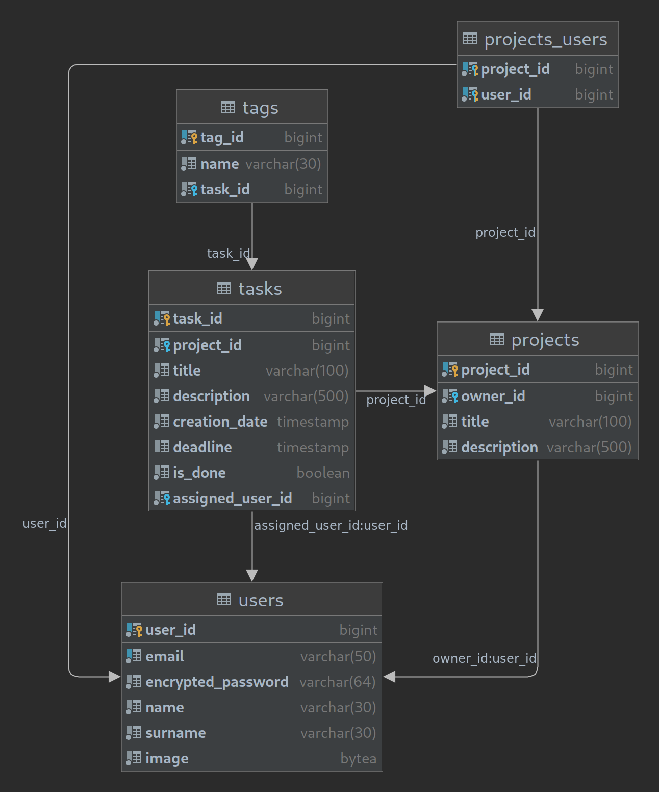

# dotdottask

Dotdottask is a simple to-do list app that offers a wide array of planning features.

---

## Features
- add tasks quickly.
- tune tasks with customizable tags.
- host your project by adding and assign tasks.

---

## Screenshots

---

## Project structure
### Database schema

---

*Project was designed as final project for Epam JWD.*